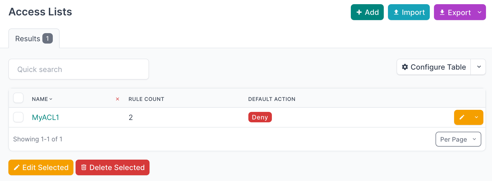

# Step 3: Tables

You are probably already familiar with object lists in NetBox.
These pages show all instances of a given model, such as Sites or Devices, in a single place.
NetBox builds these pages using table classes powered by the [`django-tables2`](https://django-tables2.readthedocs.io/) library.

We could write raw HTML `<table>` markup in every template, but that gets repetitive fast and is harder to maintain.
Using table classes also gives us sorting, pagination, and consistent styling with very little extra effort.

:blue_square: **Note:** If you skipped the previous step, run `git checkout step02-models` (if you cloned the repository `netbox-plugin-demo`).

## Create the Tables

We will create two tables, one for each of our models.

Start by creating `tables.py` inside the `netbox_access_lists/` directory:

```bash
cd netbox_access_lists/
touch tables.py
```

Open `tables.py` and add the imports below.

We import:

* `django_tables2` for basic column definitions
* NetBox's [`NetBoxTable`](https://netboxlabs.com/docs/netbox/en/stable/plugins/development/tables/#netboxtable) base class so we automatically get common NetBox columns and styling
* NetBox's `ChoiceFieldColumn` and `columns` helpers for choice fields and array fields
* Our plugin models so the tables know what they are rendering

```python
import django_tables2 as tables
from netbox.tables import ChoiceFieldColumn, NetBoxTable, columns

from .models import AccessList, AccessListRule
```

For reference, your plugin workspace should now look like this:

```text
.
├── netbox_access_lists
│   ├── choices.py
│   ├── __init__.py
│   ├── migrations
│   │   ├── 0001_initial.py
│   │   └── __init__.py
│   ├── models.py
│   └── tables.py
├── pyproject.toml
└── README.md
```

### AccessListTable

Create `AccessListTable` as a subclass of `NetBoxTable`.
Inside it, add a `Meta` class that inherits from `NetBoxTable.Meta`.
This is where we declare the model, available fields, and which columns are shown by default.

Start with this skeleton:

```python
class AccessListTable(NetBoxTable):

    class Meta(NetBoxTable.Meta):
        model = AccessList
        fields = (
            'pk',
            'id',
            'name',
            'default_action',
            'comments',
            'actions',
        )
        default_columns = ('name', 'default_action', 'actions')
```

The `model` attribute tells `django-tables2` which model to use when building the table, and the `fields` attribute dictates which model fields get added to the table.

A few quick notes about these columns:

* `pk` and `actions` are provided by `NetBoxTable`. They render the row selection checkbox and the actions' dropdown.
* `id` is the numeric primary key. NetBox commonly includes it, but it is usually not shown by default.
* `name`, `default_action`, and `comments` come from the fields on the `AccessList` model.

This will already work, but we can make it nicer.

First, make the `name` column clickable, so each row links to the object view:

```python
class AccessListTable(NetBoxTable):
    name = tables.Column(
        linkify=True,
    )
```

Next, `default_action` is a choice field with a color.
Use `ChoiceFieldColumn` so NetBox can render the label and its color consistently:

```python
    default_action = ChoiceFieldColumn()
```

Finally, add a small quality of life column that shows how many rules each access list has.
We will call it `rule_count`.
The list view will populate this using a queryset annotation in a later step.

Add the column, then include it in `fields` and `default_columns`:

```python
class AccessListTable(NetBoxTable):
    name = tables.Column(
        linkify=True,
    )
    default_action = ChoiceFieldColumn()
    rule_count = tables.Column(
        verbose_name='Rules',
    )

    class Meta(NetBoxTable.Meta):
        model = AccessList
        fields = (
            'pk',
            'id',
            'name',
            'default_action',
            'rule_count',
            'comments',
            'actions',
        )
        default_columns = ('name', 'default_action', 'rule_count', 'actions')
```

Once the plugin is wired up, the table will look like this:



### AccessListRuleTable

Now we will create a table for `AccessListRule` using the same pattern.

We will:

* Linkify `access_list`, `index`, `source_prefix`, and `destination_prefix`
* Render `source_ports` and `destination_ports` using `ArrayColumn`
* Render `protocol` and `action` using `ChoiceFieldColumn` so their labels and colors are displayed correctly

```python
class AccessListRuleTable(NetBoxTable):
    access_list = tables.Column(
        linkify=True,
    )
    index = tables.Column(
        linkify=True,
    )
    source_prefix = tables.Column(
        linkify=True,
    )
    source_ports = columns.ArrayColumn()
    destination_prefix = tables.Column(
        linkify=True,
    )
    destination_ports = columns.ArrayColumn()
    protocol = ChoiceFieldColumn()
    action = ChoiceFieldColumn()

    class Meta(NetBoxTable.Meta):
        model = AccessListRule
        fields = (
            'pk',
            'id',
            'access_list',
            'index',
            'source_prefix',
            'source_ports',
            'destination_prefix',
            'destination_ports',
            'protocol',
            'action',
            'description',
            'actions',
        )
        default_columns = (
            'access_list',
            'index',
            'source_prefix',
            'source_ports',
            'destination_prefix',
            'destination_ports',
            'protocol',
            'action',
            'comments',
            'actions',
        )
```

### Full `tables.py`

Your complete `tables.py` file should now look like this:

```python
import django_tables2 as tables
from netbox.tables import ChoiceFieldColumn, NetBoxTable, columns

from .models import AccessList, AccessListRule


class AccessListTable(NetBoxTable):
    name = tables.Column(
        linkify=True,
    )
    default_action = ChoiceFieldColumn()
    rule_count = tables.Column(
        verbose_name='Rules',
    )

    class Meta(NetBoxTable.Meta):
        model = AccessList
        fields = (
            'pk',
            'id',
            'name',
            'default_action',
            'rule_count',
            'comments',
            'actions',
        )
        default_columns = ('name', 'default_action', 'rule_count', 'actions')


class AccessListRuleTable(NetBoxTable):
    access_list = tables.Column(
        linkify=True,
    )
    index = tables.Column(
        linkify=True,
    )
    source_prefix = tables.Column(
        linkify=True,
    )
    source_ports = columns.ArrayColumn()
    destination_prefix = tables.Column(
        linkify=True,
    )
    destination_ports = columns.ArrayColumn()
    protocol = ChoiceFieldColumn()
    action = ChoiceFieldColumn()

    class Meta(NetBoxTable.Meta):
        model = AccessListRule
        fields = (
            'pk',
            'id',
            'access_list',
            'index',
            'source_prefix',
            'source_ports',
            'destination_prefix',
            'destination_ports',
            'protocol',
            'action',
            'description',
            'comments',
            'actions',
        )
        default_columns = (
            'access_list',
            'index',
            'source_prefix',
            'source_ports',
            'destination_prefix',
            'destination_ports',
            'protocol',
            'action',
            'actions',
        )
```

That is all we need for listing these objects.
Next, we will define forms so users can create and edit access lists and rules in the UI.

<div align="center">

:arrow_left: [Step 2: Models](/tutorial/step02-models.md) | [Step 4: Forms](/tutorial/step04-forms.md) :arrow_right:

</div>
