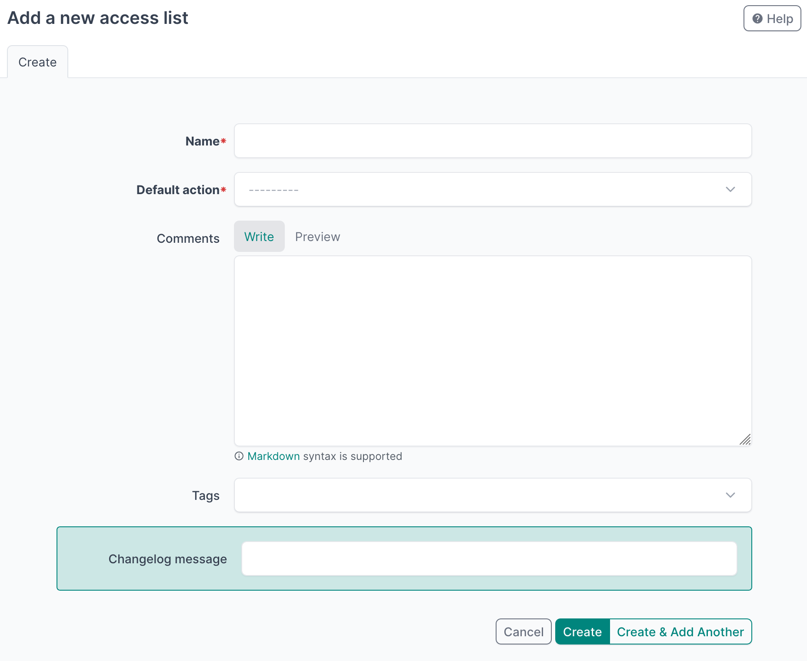

# Step 4: Forms

Form classes generate HTML form elements for the user interface, and they also process and validate user input.
In NetBox, forms are used primarily to create, modify, and delete objects.
In this step, we will create one form class for each of our plugin models.

:blue_square: **Note:** If you skipped the previous step, run `git checkout step03-tables` (in case you've cloned the repository `netbox-plugin-demo`).

## Create the Forms

Begin by creating a file named `forms.py` in the `netbox_access_lists/` directory of your plugin project.

```bash
cd netbox_access_lists/
touch forms.py
```

At the top of the file, import NetBox's [`NetBoxModelForm`](https://netboxlabs.com/docs/netbox/en/stable/plugins/development/forms/#netboxmodelform) class, which will serve as the base class for our forms.
We will also import our plugin models.

```python
from netbox.forms import NetBoxModelForm

from .models import AccessList, AccessListRule
```

For reference, your plugin project should now look like this:

```text
.
├── netbox_access_lists
│   ├── choices.py
│   ├── forms.py
│   ├── __init__.py
│   ├── migrations
│   │   ├── 0001_initial.py
│   │   └── __init__.py
│   ├── models.py
│   └── tables.py
├── pyproject.toml
└── README.md
```

## AccessListForm

Create a class named `AccessListForm` that subclasses `NetBoxModelForm`.
Under it, define a `Meta` subclass specifying the model and fields.

Notice that `tags` is included even though we did not define it on the model.
That is because `NetBoxModel` provides tag support automatically.

```python
class AccessListForm(NetBoxModelForm):

    class Meta:
        model = AccessList
        fields = ('name', 'default_action', 'comments', 'tags',)
```

This is enough to get a working form, but we can make one small improvement.
Instead of letting Django generate a basic field for `comments`, we can use NetBox's [`CommentField`](https://netboxlabs.com/docs/netbox/en/stable/plugins/development/forms/#utilities.forms.fields.fields.CommentField).
It applies NetBox friendly defaults like help text and layout.

To do this, import `CommentField` and override the `comments` field on the form:

```python
from utilities.forms.fields import CommentField
# ...
class AccessListForm(NetBoxModelForm):
    comments = CommentField()

    class Meta:
        model = AccessList
        fields = ('name', 'default_action', 'comments', 'tags')
```

Once our plugin is finished, the form will render similar to this:



## AccessListRuleForm

Next, we will create a form for `AccessListRule` using the same pattern:

```python
class AccessListRuleForm(NetBoxModelForm):
    class Meta:
        model = AccessListRule
        fields = (
            'access_list',
            'index',
            'description',
            'source_prefix',
            'source_ports',
            'destination_prefix',
            'destination_ports',
            'protocol',
            'action',
            'comments',
            'tags',
        )
```

By default, Django renders foreign keys as a static dropdown that includes every available object.
That works fine for small datasets, but it becomes painful when your NetBox instance has lots of objects.

To avoid that, NetBox provides [`DynamicModelChoiceField`](https://netboxlabs.com/docs/netbox/en/stable/plugins/development/forms/#dynamic-object-fields), which uses a dynamic search widget backed by the NetBox REST API.
This keeps the form fast and makes it easier for users to find what they need.

:green_circle: **Tip:** The `DynamicModelMultipleChoiceField` class is also available for many-to-many fields, which support the assignment of multiple objects.

We will use `DynamicModelChoiceField` for the three foreign key fields in this form:

* `access_list`
* `source_prefix`
* `destination_prefix`

First, update the imports at the top of `forms.py`.
`AccessList` is already imported, but we also need `Prefix` from the `ipam` app.

```python
from ipam.models import Prefix
from netbox.forms import NetBoxModelForm
from utilities.forms.fields import CommentField, DynamicModelChoiceField

from .models import AccessList, AccessListRule
```

Now override the relevant fields on `AccessListRuleForm`, using an appropriate queryset for each.
Since `source_prefix` and `destination_prefix` are optional on the model, we set `required=False` to match that behavior.
(Be sure to keep in place the `Meta` class we already defined.)

```python
class AccessListRuleForm(NetBoxModelForm):
    access_list = DynamicModelChoiceField(
        queryset=AccessList.objects.all(),
    )
    source_prefix = DynamicModelChoiceField(
        queryset=Prefix.objects.all(),
        required=False,
    )
    destination_prefix = DynamicModelChoiceField(
        queryset=Prefix.objects.all(),
        required=False,
    )
    comments = CommentField()

    class Meta:
    # ...
```

## Full `forms.py`

Your full `forms.py` file should now look like this:

```python
from ipam.models import Prefix
from netbox.forms import NetBoxModelForm
from utilities.forms.fields import CommentField, DynamicModelChoiceField

from .models import AccessList, AccessListRule


class AccessListForm(NetBoxModelForm):
    comments = CommentField()

    class Meta:
        model = AccessList
        fields = ('name', 'default_action', 'comments', 'tags')


class AccessListRuleForm(NetBoxModelForm):
    access_list = DynamicModelChoiceField(
        queryset=AccessList.objects.all(),
    )
    source_prefix = DynamicModelChoiceField(
        queryset=Prefix.objects.all(),
        required=False,
    )
    destination_prefix = DynamicModelChoiceField(
        queryset=Prefix.objects.all(),
        required=False,
    )
    comments = CommentField()

    class Meta:
        model = AccessListRule
        fields = (
            'access_list',
            'index',
            'description',
            'source_prefix',
            'source_ports',
            'destination_prefix',
            'destination_ports',
            'protocol',
            'action',
            'comments',
            'tags',
        )
```

With our models, tables, and forms in place, we are ready to create views to bring everything together.

<div align="center">

:arrow_left: [Step 3: Tables](/tutorial/step03-tables.md) | [Step 5: Views](/tutorial/step05-views.md) :arrow_right:

</div>
